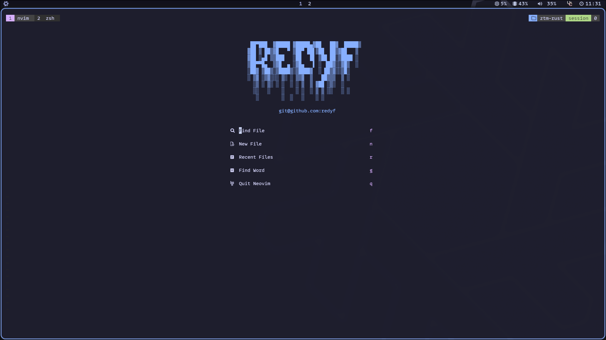
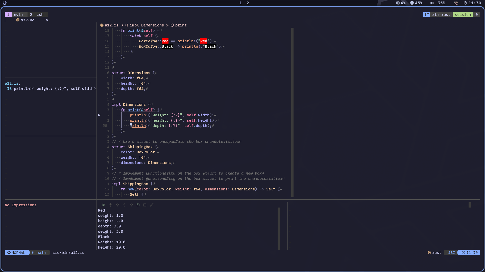
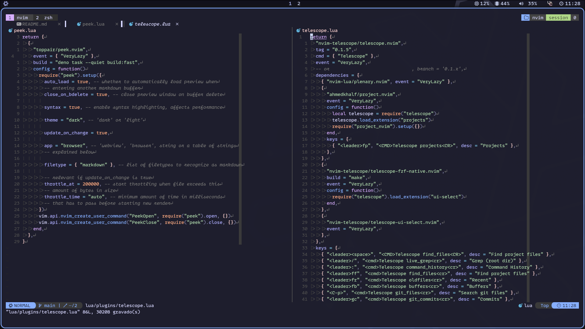

<h1 align="center">
<a href='#'></a>
  <br>
  <br>
  <div>
    <a href="https://github.com/redyf/Moon/issues">
        
    </a>
    <a href="https://github.com/redyf/Moon/stargazers">
        
    </a>
    <a href="https://github.com/redyf/Moon">
        
    </a>
    <a href="https://github.com/redyf/Moon/blob/main/LICENSE">
        
    </a>
    <br>
            
  </div>
</h1>

<h1 align="center">❄️ Moon ❄️</h1>
<h3 align="center">

<details>
    <summary>Showcase</summary>





</details>

</h3>

## What's Moon??

Moon is really similar to <a href="https://github.com/redyf/Neve">Neve</a>, which is my Nixvim config. As some users wouldn't like to use Nix, I "ported" Neve to Lua and called it Moon because **WhY NoT**.

## Installation

You don't need nix to use Moon but just in case you'd like to use it, follow the second installation guide.

Try it before installing with: <b>nix run github:redyf/moon</b>

<details>
    <summary><b>Installation Guide</b></summary>
    <br>

```markdown
1- Make a backup of your current Neovim config

# required

mv ~/.config/nvim{,.bak}

# optional but recommended

mv ~/.local/share/nvim{,.bak}
mv ~/.local/state/nvim{,.bak}
mv ~/.cache/nvim{,.bak}

2- Clone the repo:

- git clone https://github.com/redyf/Moon ~/.config/nvim
- Remove the .git folder, so you can add it to your own repo later
- rm -rf ~/.config/nvim/.git
- Start Neovim
- nvim
```

</details>

<details>
    <summary><b>Installation Guide for Nix</b></summary>
I'm assuming you already use Nix flakes but in case you don't, please check this tutorial to enable it:

[Flakes](https://nixos.wiki/wiki/Flakes)

<br>
        
```
1- Open flake.nix and add Moon.url = "github:redyf/Moon" to your inputs.

2- Install it by adding inputs.Moon.packages.${system}.default to your environment.systemPackages or home.packages if you're using home-manager.

3- Rebuild your system and you should be done

```

</details>

## Quick Start

Moon is highly customizable. Here are some important files for configuring your environment:

- **init.lua:** Main file that loads Lazy.nvim.

- **lua/keymaps.lua:** This file contains custom key mappings. You can add your own keyboard shortcuts to enhance productivity.

- **lua/sets.lua:** Add or remove options and adjust their specific settings.

- **lua/config/** In this directory you can add custom functions/features for your config.

- **lua/plugins/** Add or remove plugins.


## Contribution

Contributions are welcome! Feel free to [open an issue](https://github.com/redyf/Moon/issues) to report problems, suggest improvements, or submit pull requests to add new features to Moon.

## License

This project is licensed under the [MIT License](LICENSE). See the LICENSE file for more details.

## Support

Encountered an issue or have a question? Visit our [Issue Tracker](https://github.com/redyf/Moon/issues) or message me on Discord, my username is **redyf**

Happy coding!
```
